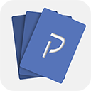

<p align="center">
  
</p>

# Klaf

Klaf is a Kotlin Multiplatform vocabulary trainer focused on spaced repetition and mnemonic-based memorization.

The repository contains Android, Desktop, and iOS apps that share the same `domain`, `data`, `presentation`, and `di` layers.

Android currently has the most complete platform integration. Desktop and iOS already reuse the shared UI and core logic, but some platform services are still stubbed or limited compared with Android.

## Features

- Deck and card management for vocabulary study
- Spaced repetition review flow
- Word pronunciation playback
- Word autocomplete suggestions
- Dark and light themes
- Shared Compose UI across platforms
- Android-specific integrations for notifications, Firebase-backed services, and smart text selection

## Project Structure

- `apps/Android` - Android application module and Android resources
- `apps/Desktop` - Compose Desktop launcher
- `apps/iOS` - Xcode project and SwiftUI host for the iOS app
- `domain` - core entities, use cases, and repository contracts
- `data` - persistence, networking, and repository implementations
- `presentation` - Compose Multiplatform UI, navigation, and view models
- `di` - platform-specific dependency wiring
- `build-logic` - custom Gradle plugins and build logic
- `preview` - screenshots and GIF previews used in the README

## Tech Stack

- Kotlin Multiplatform
- Compose Multiplatform for shared UI
- Kotlin Coroutines and Flow
- Koin for dependency injection
- Room and DataStore for local persistence
- Ktor and Kotlinx Serialization for networking
- Firebase Authentication, Firestore, and Crashlytics on Android
- WorkManager on Android
- Gradle Kotlin DSL with included build logic in `build-logic`

## Platform Status

- Android is the primary app target and has the broadest platform integration.
- Desktop reuses the shared UI and local data stack, but several platform services are development-oriented or no-op.
- iOS runs the shared Compose UI through a SwiftUI host, but some integrations are still intentionally minimal.

## Requirements

- JDK 17
- Android Studio or IntelliJ IDEA for Android/Desktop work
- Xcode for iOS work
- Android SDK for the Android app

## Run

### Android

Use Android Studio, or run:

```bash
./gradlew :Android:installDebug
```

### Desktop

Run the desktop app with:

```bash
./gradlew :Desktop:run
```

### iOS

Open the Xcode project and run the `iOS` scheme:

```text
apps/iOS/iosApp.xcodeproj
```

## Compatibility

- Android `minSdk`: 26
- Android `targetSdk`: 33
- Desktop: JVM 17

## Legacy Version

The pre-Kotlin-Multiplatform version of the project is available here:

https://github.com/NikolayKuts/Klaf

## Animation samples


## Screen samples


